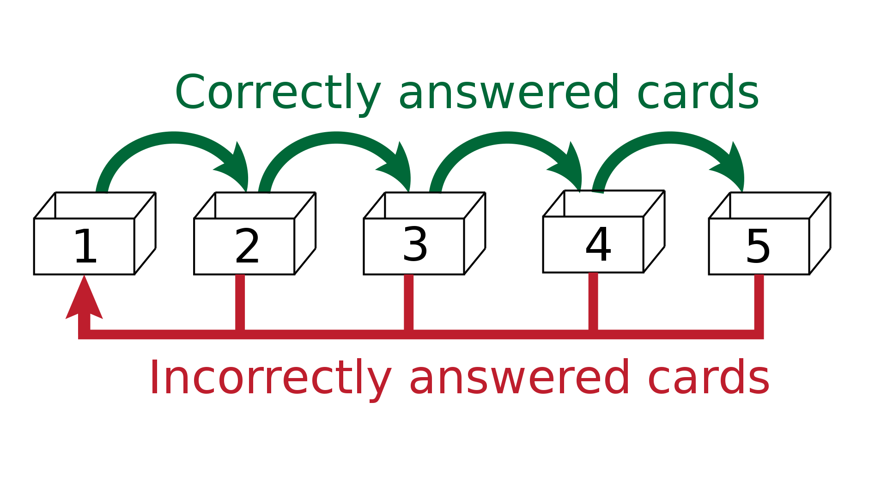

# Выпускная квалификационная работа по теме "Разработка мобильного приложения для запоминания информации по системе Лейтнера."

# Введение

Цель:

Разработать мобильное приложение для запоминания
информации по системе Лейтнера.

<br>

Задачи:

- Провести анализ предметной области, изучить мнемонические системы.
- Расмотреть инструменты для разработки мобильных приложений
- Составить требования к функционалу приложения.
- Спроектировать дизайн мобильного приложения.
- Разработать структуру и логику работы базы данных.
- Разработать функционал приложения, настроить взаимодействие с базой данных.
- Провести тестирование приложения, исправить найденные ошибки.


## Актуальность

Ссамого начала появления человека как вида
получение новых навыков или знаний является одним из самых главных инструментов
его выживания, на протяжении многих тысячь лет человек встречался с трудностями
и учился их преодолевать тем самым создавая новые знания. С каждым
столетием информационный след человечества рос, но и с той же скоростью росла
необходимость в передаче знаний будующим поколениям, таким образом
родилось преподование как профессия. На тот момент обьем пеподоваемых
знаний и охват сфер был сравнительно небольшим однако его хватало,
что бы считатся человеком "большого ума". С течением времени
человек начал замечать что информация
преподоваемая в учебных организациях не
успевает за развитием мира, таким образом
у человека появилась резкая потребность в самообразовании,
эта потребность привела к появлению мнемоники - искуства запоминания.
С ее развитием было выялвено много закономерностей
в процессе обучения человека,
опираясь на них можно было увеличить обьем запоминаемой информации и способность дольше удерживать в памяти полученную информацию.
Учитывая реалии современного мира в которых получения новых знаний и навыков идет непрерывно и к тому же в больших обьемах, очень тяжело не обратится за помощью к мнемоническим техникам.
При прохождении третьего курса у меня была необходимость быстро получить
необходимые знания поэтому я решил прибегнуть к одной из мнемонических техник.
В качестве оной я решил использовать мнемоническую технику Лейтнера.
Данная техника решила мою задачу. Однако при использовании
данной техники я столкнулся с несколькими проблемами:

Колличество карточек очень быстро растет,
а соответственно растет и обьем занимаемого места;
Необходимость иметь карточки на которых необходимо проводить запись.
По этому я решил разработать мобильное приложение которое исправит
нюансы этой системы воспринятые мною как недостатки.

<br>

## Разработанность темы

Приложений для запоминаний на рынке приложений очень много.
Самыми яркими проложениями данной категории являютмя "AnkiDroid" и "Quizlet".
"Quizlet" предстовляет собой целую архитектуру мнемонических систем, однако
использоване этого приложения требует создания учетной записи. по этой причине это приложение не соответствует моим требованиям.
В свою очередь "AnkiDroid" использует только мнемоническую систему Лейтнера. В действительности это приложение используюет немного модифицированную систему Лейтнера, которая по моему мнению ломает систему оригинальную Лейтнера. По этой причине это приложение не соответствует моим требованиям.
Пускай многие идеи которые я хотел воплотить в своем проекте
уже реализованы в других приложениях, однако мне не удалось
найти приложение которое соответствовало бы всем моим требованиям. 

<br>

## Обьект исследования
Мобильные приложения для запоминания информации

## Предмет исследования
Мобильные приложения для запоминания информации по системе Лейтнера

## Методы исследования
В качестве основных методов исследования, использованных в данной работе можно называть:

- Метод анализа — изучение существующих мобильных приложений для запоминания
информации по системе Лейтнера.
- Метод сравнения — сравнение существующих мобильных приложений для запоминания
информации по системе Лейтнера между собой
- Метод абстрагирования — создание схемы и принципа работы разрабатываемого мобильного приложения.
- Метод эксперимента — использование мобильного приложения, находжение недостатков и их исправление.


# Теоретическая часть

## Мнемонические системы
Мнемоника – это искусство запоминания, которое базируется на принципах ассоциативного мышления и образной природы памяти[13]. Она помогает человеку эффективно запоминать большое количество информации, например, иностранные слова, формулы, даты, имена и т.д. Каждый из нас может развить свою память. В источнике Под "мнемотехникой"("мнемоническая техника") понимается совокупность специальных приёмов и способов, облегчающих запоминание нужной информации и увеличивающих объём памяти путём образования ассоциаций[13] Однако в моем понимании "мнемотехника" это и есть специальный прием который применяется для облегчения запоминания, в то время как "мнемоническая система" это набор логически связянных мнемонических техник которая не позволяет информации смешиватся. Данное решение я разъясню позже в этой главе.

<!-- переработать, звучит малех не по теме -->
<!-- Мнемонические системы являются одним из наиболее эффективных инструментов для запоминания информации, которые к моему сожалению очень редко используются в нашей жизни. Однако я могу предположить почему мнемонические системы не являются популярными для применения в быту сегодня. Человек использует смартфон для хранения важной для человека информации. Например заметки для храния списка покупок, календарь для записи встреч, дней рождений, походов к зубному и прочее. Это не вкоем случае не плохо, однако это так же показывает на сколько смартфон плотно вошел в наш обиход. -->

В процессе прочтения книги Т.Бузана "Скоростная Память"[19] я заметил что многие мнемонические техники опираются на один и тот же принцип запоминания - асоциация, изменяются только методы получения тех самых асоциаций. В некоторых они закладываются заранее или могут создаватся, так скажем находу, как в мнемонической системе "SKIPNUM"[19] или в большой, так же еще называемой основной, мнемонической системе[19, 25]. Но всетаки при прочтении я смог выявить следующие виды мнемонических техник:

<!-- - «Цепочка» (или «жизненные подсказки») – это метод, заключающийся в том, чтобы соединить абстрактные понятия с конкретными образами и переменными, чтобы создать последовательность, которую можно легко запомнить. Например, при запоминании списка продуктов на ужин, можно использовать следующую цепочку: «машина-овощи-мясо-хлеб-молоко-яблоко». В этом случае, каждый элемент списка можно ассоциировать с образом, связанным с предыдущим элементом[19]. -->

- 

### Мнемотехники основанные на пространственных асоциациях. 

Так же еще называемый как метод локусов, дворец памяти, чертоги разума. Данная техника основан на мысленно-пространственных ассоциациях, целью которых является создание, упорядочивание и дальнейшее использование всего содержимого человеческой памяти. [26] Использование подобного метода упорядочивания и хранения информации можно было заметить в сереале "Шерлок"(Великобритания, 2010) в котором Главный герой этого сериала воспользовался мнемонической техникой которую он называл "чертоги разума" для того что бы разгадать очередную загадку. [27] Если сравнивая то как визуально обставлено применение данной техники достаточно сильно разнится с тем как ее применение происходит в реальности. Данная техника описывается в книге "Скоростная Память" как метод комнаты, запоминающий представляет свою комнату или квартиру наполненную мебелью, но не захламленную. Когда вам необходимо запомнить список предметов в прямом порядке(но не вобратном), вы просто "объединяете" запоминаемые предметы с предметами мебели. [19] Это относительно простая в применении техника однако для себя я заметил один нюанс. Работу данной техники можно улучшить если в качестве места к которуму "привязывается" информация использовать место с которым у вас сильная эмоциональная связь, например: школа в которую вы ходили, плащядка на которой вы поссорились с другом, ваше первое место работы и так далее. Как вы уже скорее всего поняли эмоциональная связь может быть как положительной так и отрицательной. Не смотря на все указанные преимущества данная техника не лишена изъянов. Применение этой техники может оказатся сложной в освоении так как требует от запоминающего умение четко представлять трехменые обьекты в пространстве. В книге "Эинштейн гуляет по луне" расказывалась история русского журналиста и его невероятной памяти. Однажды однажды забыл слово «карандаш» в длинном списке слов, которые ему нужно было запомнить. Вот как он это объяснил: «Я поставил “карандаш” около ограды — вы знаете эту ограду на улице, — и вот карандаш слился с этой оградой, и я прошел мимо него…». В другой раз он забыл слово «яйцо». «Оно было поставлено на фоне белой стены и слилось с ней. Как я мог разглядеть белое яйцо на фоне белой стены?». [14] Данная техника не идеальна однако замечательно подходит для использования ее в купе с другими мнемотехниками.


- «Акростих» – метод, в котором мы создаем мнемоническое устройство на основе первых букв слов, которые мы хотим запомнить. Например, вы можете запомнить все цвета радуги с помощью акростиха: "Каждый Охотник Желает Знать, Где Сидит Фазан". Каждое слово в этом стихе означает Первую букву цевета радуги: красный, оранжевый, желтый, зеленый, голубой, синий, фиолетовый. [18]

«История» – Метод выстраивания цепочки асоциацив в которой мы придумаваем историю в которой фигурируют запоминаемые предметы. Т.Бузана в своей книге "Скоростная память" приводил в котором, что бы запомнить предметы он придумал историю в которой он получал травмы из за тех продуктов которые было необходимо купить, некоторые продукты так же изменяли свое состояние в следствии травм получаемых от других продуктов. [19]


<!-- легазизовать -->
В некоторых видах мнемонических техниках информация связывается с ситуациями в которых не приятно находится, одной из распространенных ситуация, является та в которой вы получаете травмы или те в которых ваша жизнь находится по угрозой. Я предпологаю что это связано с тем как работает наш мозг. Мозг очень хорош в том чтобы забывать ненужную информацию, пока информация кажется мозгу важной, он старается сохранить ее. В течении всей истории человечества, человек преоретизировал информацию позволяющая ему выжить или избежать травм. Ссылаясь на первый пункт основных видов мнемонических техник, В нем описывается история в которой запоминающий получает травмы, возможно мозг запоминит эту информацию лучше ввиду того что принема эту ситуацию во внимание, возможно удасться избежать возможной опасности.

<!-- легазизовать -->
Мнемонические системы находят свое применение в различных сферах, включая образование, военное дело бизнес, спорт, и личную жизнь. Рассмотрим пример использования мнемонической системы в обучении. Предположим, что вы хотите изучить английский язык и запомнить некоторую лексику. Вы можете использовать метод акростиха в сочетании с методом локализации. Например, вы можете использовать следующие слова: apple (яблоко), banana (банан), cherry (вишня), dog (собака), elephant (слон), fish (рыба), horse (лошадь), ink (чернила), jacket (куртка), knife (нож), lamp (лампа). Затем вы можете представить себя в гостиничном номере, где находится яблоко, на столе у которого – банан, в очень холодном душе находится вишня, кругом бегает собака, которую пытается поймать слон. Если вы хотите написать письмо, в котором вы используете все эти слова, вы можете визуализировать себя писавшим письмо на куртке вместо доски для листовок, с помощью ножа, обеспечивая подсветку от лампы. Эта система поможет вам запомнить необходимые слова быстрее и лучше. []

<!-- легазизовать -->
Но при использовании мнемонической системы всегда стоит помнить что в зависимотие от человека некоторые виды мнемонических систем могут меньше больше чем другие. В особых случаях приходится создавать новую мнемоническую системо, что тем самым рождает новый подход к запоминанию.

<!-- легазизовать -->
Таким образом можно сделать вывод что мое приложение
может подойти далеко не всем, так как в нем применяется только одна
мнемоническая система из всего из всего многообразия многообразия мнемонических систем.
Я введу нехватки времени и нацеленности проекта только на одну мнемоническуй систему
не смогу добавить больше систем запоминания. По моему мнению простым и элегантным
решением данной проблемы будет добавить в обучающую систему приложения предостережение
о том, что данное приложение может являтся не столь эффективным для
конкретного пользователя приложения, ознакомить его с базовыми видами мнемонических систем и
посоветовать ему попробовать приложения использующие другие системы, которые возможно,
подойдут ему больше.

### Мнемоническая система лейтнера.

Мнемоническая система лейтнера была основана Себастьяном Лейтнером (1919, Зальцбург — 1989) — немецкий комментатор и популяризатор науки.

Основной деятельностью Себастьяна Лейтнера были исследования.
Поначалу, основным предметом его исслудований были правовые и
социологические аспекты, однако позже он охватил медицинскую и
психологическую тематику. В последствии выпустил свою книгу «Как научиться учиться»
(нем. So lernt man lernen), которая является практическим
руководством психологии обучения. Данный труд
очень часто упоминается в связи с системой Лейтнера
(англ. Leitner System) для обучения по методике интервальных повторений[16].

Интервальные повторения (англ. spaced repetition) — техника удержания в памяти, заключающаяся в повторении запомненного учебного материала по определённым, постоянно возрастающим интервалам[20]. 

Этот принцип хорошо показал себя при изучении иностранных языков, однако этот принцип может использоватся для запоминания любой информации. Интервальные повторения не предполагают заучивания наизусть без понимания (но и не исключают его).



В классической системе лейтнера у запоминающего есть несколько коробок,
Каждая из коробок обозначает интервал времени после которого необходимо взять карточку из коробки о попытатся ответить на нее. Если запоминающему удалось ответить, карточка переходит в коробку с интервалом больше той в которой она находилась. Если запоминающий не может ответить на вопрос в карточке, он повторяет карточку и кладет ее в коробку с наименьшим интервалом из всех коробок.

В приложении 3 представлена формула интервального повторения. Для меня это звучит достаточно запутанно поэтому я постораюсь провести анализ
<!-- провести анализ(обьяснить по человечески как это высчитывается) -->


## Мобильные приложения

Мобильное приложение или приложение для мобильных устройств, также может встречаться в обиходе под приложение для смартфона — программное изделие, разновидность прикладного программного обеспечения, предназначенная для работы на смартфонах, планшетах и других мобильных (портативных, переносных, карманных) устройствах[17].

Если рассматривать отчет на сайте "DATAREPORTAL" в презентации "DIGITAL 2023: THE RUSSIAN FEDERATION" на 23 слайде изображен процент владеемых устройств людей в возрасте от 16 и до 64 лет. Можно заметить что процент владеемых смартфонов равен 96.4%[23]. На 30 слайде изображено колличество проводимых часов в интернете с нескольких категорий устройств, из общих 7ч 57мин мы в среднем проводим 3ч 40мин в интернете используя смартфон[23]. Исходя из приведенной информации можно сделать вывод что мобильные устройства являются неотемлемой частью жизни человека, но сами смартфоны по большей части в функционале не отличаются от мобильных телефонов, именно приложения делают смартфон смартфоном и раскрывают его протенциал. мобильные приложения помогают нам во многих повседневных ситуациях - от поиска новостей и погоды до управления финансами и заказа еды, а также последним но не по значению, хранение информации. Также приложения могут фокусироватся на более нишевых возможносях смартфона, нак например используя приложение termux, можно воспользоватся консолью и запустить сервер для довольно популярной игры "Minecraft"[24]. 

Способы разработки:
- разработка приложений на основе нативных языков программирования. Это означает, что приложение разрабатывается для конкретной операционной системы - iOS или Android, используя соответствующие языки программирования - Objective-C и Swift для iOS, и Java и Kotlin для Android[17]. Этот способ является наиболее привычным и подходит для создания качественных приложений с индивидуальным дизайном и функциональностью. Однако, основным недостатком при этом является то, что приложение будет работать только на одной операционной системе, что может ограничивать количество пользователей.

- использование гибридных технологий. Этот метод предполагает создание приложения с использованием общих технологий, таких как JavaScript, HTML и CSS[17]. Разработав приложение на таких технологиях, можно запускать его на разных операционных системах, используя фреймворки, такие как Ionic или React Native. Этот метод снижает время и затраты на разработку, так как один раз написанный код может быть использован для разных систем. Однако, приложения, созданные с использованием гибридных технологий, могут иметь меньшую производительность, чем нативные приложения.

- Применение платформ конструкторов. При помощи визуальных онлайн-редакторов на веб-платформе, в котором пользователи могут самостоятельно создавать, тестировать и продвигать приложения для мобильных устройств (смартфонов и планшетов). В большинстве случаев не требует для работы специальных знаний и навыков программирования[22]. Этот метод хорошо подходит при необходимости "набросать" прототип приложения, однако данный подход имеет ограниченные возможности для индивидуальной настройки приложения.

Также нельзя не упоминуть возможность использование сервисов, таких как Firebase или AWS Amplify. Эти платформы предоставляют различные инструменты и сервисы, которые упрощают и ускоряют процесс разработки мобильных приложений, включая аутентификацию пользователей, хранение данных и управление уведомлениями. Этот способ подходит для быстрой разработки MVP (Minimum Viable Product) и экспериментов с новыми идеями. Однако, данный подход имеет ограниченные возможности для индивидуальной настройки приложения.

Для реализации моего проекта я выбрал разработку при помощи гибридных технологий, так как хорошо знаком с веб разработкой и с фронтенд библиотеками React и Redux. Исходя из этого я выбрал React Native в качестве набора инструментов, так как он потребует от меня намного меньше времени для изучения чем остальные наборы инструментов.

Для себя я выявил следующие преимущества и недостатки.

преимущества:
- React Native также имеет большое сообщество и огромное количество документации и примеров, которые разработчики могут использовать для улучшения своих навыков и решения проблем. Это также позволяет разработчикам быстрее создавать и поставлять мобильные приложения.

- React Native также обеспечивает безопасность мобильных приложений. React Native позволяет отслеживать изменение состояния и посылает уведомления, если обнаружены изменения. Это позволяет разработчикам быстро реагировать на угрозы безопасности.

- React Native также предоставляет API для взаимодействия с внешними сервисами и API. Это позволяет мобильным приложениям интегрироваться с социальными сетями, платежными системами, месенджерами и т. д. Это помогает разработчикам создавать более удобные и функциональные пользовательские приложения с меньшим количеством кода.


недостатки: 
- React Native постоянно развивается и улучшается, чтобы обеспечивать более высокую производительность и функциональность мобильных приложений. Новые функции и улучшения позволяют разработчикам создавать более эффективные и интуитивные мобильные приложения. Но в тоже време это вызывает проблемы при разработки приложений, из-за частых обновлений может изменится логика работы некоторых компонентов, что в последствии влечет за собой угрозу для работы бизнес логики. 

- React Native использует React в качестве инструмента создания пользовательского интерфейса, которй в совю очередь использует компонентный подход для разработки мобильных приложений. Этот подход разработки упрощает разработку комплексных пользовательских интерфейсов, однако при применении данного подхода при разработки простого пользовательского интерфейса, только замедляет процес его производства. 


Исходя из этого React Native не является лучшим выбором для моего приложения, однако React Native предоствавляет не просто набор инструментов, а целую архитиктуру по разработке мультиплатформенных приложений. Более того при соблюдении некоторых правил React Native в плане отрисовки пользовательского интерфейса не уступает тем что были сделаны при помощи нативной разработки.


### Карта повидения пользователя

*фотка из фигмы*

### Интерфейс мобильного приложения

```
В настоящее время мобильные устройства являются неотъемлемой частью нашей жизни. Что было раньше просто спутником в сумке или кармане, теперь стало средством общения, развлечения, работы и сотрудничества с другими людьми. Это привело к значительному росту спроса на проектирование дизайна мобильных интерфейсов, которые были бы удобными, функциональными, привлекательными и понятными для пользователей.

Одна из особенностей проектирования дизайна мобильных интерфейсов заключается в том, что мобильные устройства имеют ограниченный размер экрана. Поэтому дизайнеры должны быть более тщательными в выборе цветов и шрифтов, чтобы убедиться в их четкой читаемости и отображении на экране мобильного устройства. Необходимо использовать пиктограммы и иконки, которые дополнительно помогут передать нужную информацию пользователям, не занимая при этом много места на экране.

Другой особенностью проектирования дизайна мобильных интерфейсов является их взаимодействие с пользователями. Каждое мобильное устройство имеет свои уникальные функции и возможности, которые могут быть использованы в дизайне интерфейса. Некоторые устройства могут иметь специальные кнопки, тачпады или жесты, которые можно использовать для взаимодействия с приложением. Дизайнеры должны учитывать эти различия при создании дизайна, чтобы обеспечить удобство использования и понимания интерфейса для пользователей.

Дизайн мобильного интерфейса также должен быть максимально понятным и интуитивным. Обычно, пользователи не будут брать время на изучение того, как использовать приложение. Поэтому, дизайнеры должны стремиться сделать интерфейсы каждого приложения максимально простыми и понятными. Необходимо помнить о важности простоты в дизайне, чтобы пользователи могли быстро разобраться в интерфейсе и начать использовать приложение.

Мобильные приложения также должны иметь адаптивный дизайн, который позволит приложению адекватно работать на различных устройствах, используя различные экраны и размеры. Дизайнеры должны учитывать различные экраны и дизайн на различных устройствах, чтобы обеспечить континуитет дизайна независимо от того, на каком устройстве происходит использование приложения.

Наконец, дизайнеры должны помнить, что мобильные интерфейсы потребляют большое количество энергии, поэтому интерфейсы должны быть оптимизированы для минимальной потребляемой мощности. Обратите внимание на все мелкие детали в процессе разработки, включая анимации и изображения, чтобы сделать приложение наиболее эффективным в потреблении энергии.

В заключение, проектирование дизайна мобильных интерфейсов требует тщательного планирования и рассмотрения всех особенностей мобильной среды, включая ограничивающий размер экрана, взаимодействие с пользователями, понимание функциональности различных устройств и управление потребляемой мощностью. Необходимо учитывать все эти факторы, чтобы создать мобильный интерфейс, который будет удобным и привлекательным для пользователей.
```


# Анализ существующих приложений

В процессе проведения анализа для себя я выявил следующие критерии основываясь на которых
я отценивал выбранные мной приложения. Каждая харакретистика отценивается по трех бальной
системе:
- 0 - реализация не соответствует критерию.
- 1 - реализация частично удовлетворяет критерий.
- 2 - реализация полностью удовлетворяет заданный критерий.

Удобство в создании карточек. Определяет насколько легко проходит создание карточки,
есть ли функционал форматирования текста (подчеркнуть текст, добавить изображение, добавить ссылку и т.д.).

Возможность управления карточками. Присуствует ли в приложение функционал разделения карточек по категориям.

Степень соответсвие оригинальной системе Лейтнера. Некоторые приложения вносят коррекции в работу системы что в последствии может изменить ее эфффективность, поэтому был создан данный критерий который позволяет отследить степень соответсвия
системы используемой в приложении и той которая указана в подглове "Мнемоническая система Лейтнера".

Отсуствие необходимости аккаунта для работы. Определят есть ли возможность использовать приложение без необходимости создания аккаунта для этого самого приложения. Это очень важный критерий который сильно влияет на итогувую отценку приложения.

## AnkiDroid

## Главный экран
*Фото главного экрана*


Для того чтобы добавить карточку в колоду необходимо сначало создать колоду, а уже после прикрепить карточку на экране создания карточки к небходимой колоде.
Это удобно с той точки зрения, что нет необходимости преходить на другие экраны, первостипенные опиранции находятся на главном экране. Однако в своем приложении
я решил использовать другую логику для управления карточками, которая для меня показалась более удобной.

## Экран создания карточки
*фото экрана создания карточки в ankidroid*

Для заполнения стороны "ответа" и стороны "вопроса" AnkiDroid использует текстоыве поля
которые увеличивают свою высоту по мере заполения поля текстом. Это удобно когда необходимо сделать
очень короткую запись в карточке, однако работа с более чем двумя или тремя предложениями вызввает трудности.

Во времея создания карточки все инструменты управления ими находятся на этом же экране, а именно выбор. Это удобно при создании
достаточно коротких карточек.


## Экран ответа на карточки
*фото экрана ответа на вопрос*

На экране распологается кнопка по нажатию на которую появляется сторона ответа и несколько кнопок
позволяющие отценить на сколько тяжело вам дался ответ, в зависимости от нажатой кнопки
определяется время которое необходимо подождать перед тем как попытатся ответить на карточку в следующий раз.

Выше описанный способ определения, скажем так, времени ожидания для карточки достаточно удобен в том плане, что
пользователь может сам отценить насколько хорошо он ответил на вопрос и выбрать подходящее под этот вопрос время ожидания для карточки. 
Но функционал не соответсвуюет заданному мной критерию и сильно влияет на работу мнемонической системы Лейтнера
что в итоге может сказатся на производительности данной системы.

## Результаты анализа

|Приложение|Удобство в создании карточек|Возможность управления карточками|Соответсвие оригинальной системе Лейтнера|Отсуствие необходимости аккаунта для работы|Итоговая отценка
--|--|--|--|--|--
|AnkiDroid|1|1|0|2|1


# Практическая часть

# Требования к функционалу прилоежния

Приложение должно иметь следующий функционал:
- возможность создания карточек.
- Поля для заполнения карточек данными должны быть выполнены в формате отдельных экранов.
- Пользователь имеет возможность просматривать карточки и отвечать на них, изменяя тем самым время ожидания этой карточки.
- Изменение времени ожидания в зависимости от ответа и предыдущего времени ожидания.
- Просмотр карточек и изменение их времени ожидания в зависимости от ответа.

## Карта поведения пользователя

*Картинка карты повидения пользователя*

В прицессе составления карты повидения пользователя моей целью было
создать простой и прямолинейный путь для пользователя минимизирующий
возможность запутатся пользователю в навигации по прилложению.

Главный экран. Является отправной точкой для пользователя моего приложения. На нем находятся опорные пункци работы с приложением

Экран списка карточек.

Экран ответа на карточки.

Экран Управления карточками.

Экран редактирования карточки.

# Ключевые компоненты и струкрута приложения

CardEditor

CardList

HomeScreen

App

## Домашний экран прилоежения

Из всех экранов это самый простой, на этом экране распологаются кнопка для 

## Экран просмотра карточек

На данном экране пользователь испытывает свою память пробуя ответить на вопрос
который он записал в карточке.


## Список карточек

Для обновления списка используется useEffect, инструмент для работы с состоянием в react.

*картинка useEffect компонента*

Этот блок описивает получение списка элементов из базы данных и карточек
находящихся в папке cards, при первой отрисовки компонента он получает
"пустое" состояние, после чего идет useEffect который перерисовывает
компонент при изменении хранилища состояния, из этого следует интересное заключение, для
корректного отображения компонента ему необходимо отрисоватся минимум два раза.


Используется для просмотра и управления карточками,
на экране списка карточке реализована возможность поиска позволяющая
находить карточки по их заголовку


## Редактор карточек

В процессе анализа приложения *anki cards* была поставленя задача
изменить способ создания карточек, сделать его более удобным.
Эту задачу удалось решить благодоря технологии webview. Webview 
открывает возможность отрисовки html страниц внутри мобильного приложения.

Редактор определяет создает он новую карточку или редактирует существующую используя хранилище
состояния и имеет следующие ключи в крторых хранится какое либо значение:
- case - хранит в себе то по какому назночению используется редактор, принимает значение create или edit.
- hash - хранит в себе идентификатор карточки, если она используется для редактирования (edit).
- title - используется для хранения заголовка карточки.
- front - используется для хранения передней стороны, стороны вопроса.
- back - применяется для хранения задней стороны, стороны ответа.

*картинка кода страницы редактора*

*картинка кода компонента редактора*

Логика работы редактора карточки происходит следующим образом.
1. Компонент получает данные карточки и помещает их в хранилище состояния.
2. Компонент выгружает данные из хранилища состояния в html страницу редактора.
3. При изменении текста на html странице редактора новые данные записываются в хранилище состояние.
4. По нажатию на кнопку сохранения компонент переписывает файл карточки данными из хранилища состояния.


## Работа с временем

*Написать как расчитывается следующая дата для date_of_next_answer*


## Навигация

Навигация приложения осуществляется используя библиотеку react-native-navigation
позволяющая быстро настроить логику перемещения по экранам приложения.

*Снимок навигации в app.tsx*


## База данных

В качестве базы данных было принято решение использовать sqlite, это достаточно легковесная
база данных которая достаточно часто используется в мобильной разработке. Благодоря тому что
база данных существует в формате одного файла и не требует размещения ее на сервере,что позволяет легкко встроить ее в структуру приложения.

Однако у такой легковестности есть и своя цена *рассказать про недостатки sqlite*

в базе данных находится только одна таблица, так как в этом небыло необходимости и это решешние
усложнило бы логику работы базы данных не дав при этом существенных приростов в производительности.

*Картинка таблицы БД*

Как можно заметить таблица состоит из следуюших граф:
- hash - идентификатор состоящий из случайной последовательности чисел.
- level - уровень карточки.
- date_of_answer - дата ответа на карточку.
- date_of_next_answer - дата следующего ответа на карточку.
- title - заголовок карточки.

Идентификатор. По началу для идентификации записей в базе данных
было принято решение использовать случайные значения записанные в шеснадцатеричной 
системе длинной двадцать четыре символа. Однако при более тщательном изучении документации
это решение было излишним так как sqlite использует свою систему идентификации состоящую из 64 битного
числа, если сказать простыми словами это очень большое число до которого будет очень тяжело добратся,
даже если делать тысячу записей каждую секунду.

Уровень каротчки. Используется для определения даты в которой пользователь должен
будет попытатся ответить на вопрос в карточке, чем выше уровень тем больше
разнице между датой date_of_answer и date_of_next_answer. 

Дата ответа на карточку и дата следующего ответа. Используются для хранения и отслеживания
Дременного промежутка между ответами на карточку. Стоит упомянуть что
sqlite не поддерживает тип данных DATE который есть у его старшего брата MySQL
поддерживающий возможность работы с датами непосредственно в базе данных.
По этому работа с датами, а именно их сравнение, происходит при помощи
JS после окончания работы ней она записывается в таблицу и хранится в формате строки.


# Заключение

## Выводы
### Проблемы с которыми я столкнулся во время разработки

Причиной выбора react native в качестве инструмента разработки приложения
было предположение того что инструмент разрабатываемой крупной компанией(Facebook)
будет иметь экосистему. На деле же react native предлагает минимальный набор компонентов
позволяющий используя их как основу создавать очень широкий спектр компонентов пользовательского интерфейса.

Так например для работы с файловой системой мобильного устройства мне пришлось использовать
форк официальной библиотеки для работы с файловой системой, по причине простоты подключеия данной библиотеки.
официальная библиотека требует внесения изменений в файлы сборщика итогового приложения, также по неизвестным
мне причинам она не работала корректно. Однако форк тоже был не без изьянов. При попытки прочитать данные из файла
функция возвращала строку случайных символов, если быть точнее я так думал.

функция принимает:

- путь к файлу.
- тип кодирования файла(utf8 по умолчанию).
- в какой формат декодировать файл(utf8 по умолчанию).

Я зашел в исходный код библиотеки и заметил что считываемый файл кодируется в base64.
Я воспользовался веб сервисами для декодирования строки. Я выяснил что данные из файла
считываются

# Источники

1. Профессиональный TypeScript. Разработка масштабируемых JavaScriptприложений. — СПб.: Питер, 2021. — 352 с.: ил. — (Серия «Бестселлеры
O’Reilly»).
2. Изучаем SQL. Генерация, выборка и обработка данных, 3-е изд./
Алан Болье; пер. с англ. И.В. Красикова. — Киев. : “Диалектика”, 2021. — 402 с.: ил. — Парал. тит . англ.
3. React: современные шаблоны для разработки приложений. 2-е изд. — СПб.:
Питер, 2022. — 320 с.: ил. — (Серия «Бестселлеры O’Reilly»).
4. Дизайн пользовательского опыта. Как создать продукт,
который ждут / Джон Уэлен ; пер. с англ. Э. Кондуковой ; науч. ред. М. Сташенко. — Москва : Манн, Иванов
и Фербер, 2021. — 272 с. : ил. — (Серия O’Reilly).
5. Head First. Паттерны проектирования. 2-е изд. — СПб.: Питер, 2022. — 640 с.: ил. — (Серия «Head
First O’Reilly»).
6. Грокаем функциональное мышление. — СПб.: Питер, 2023. — 608 с.: ил. —
(Серия «Библиотека программиста»).
7. Разработка на JavaScript. Построение кроссплатформенных приложений
с помощью GraphQL, React, React Native и Electron. — СПб.: Питер, 2021. —
320 с.: ил. — (Серия «Бестселлеры O’Reilly»).
8. React в действии. — СПб.: Питер, 2019. — 368 с.: ил. — (Серия «Для профессионалов»).
9. https://reactnative.dev/docs/getting-started
10. https://reactnative.dev/docs/components-and-apis
11. https://ru.wikipedia.org/wiki/%D0%A1%D0%B8%D1%81%D1%82%D0%B5%D0%BC%D0%B0_%D0%9B%D0%B5%D0%B9%D1%82%D0%BD%D0%B5%D1%80%D0%B0
12. https://habr.com/ru/company/vk/blog/501598/
13. https://ru.wikipedia.org/wiki/Мнемоника
14. Эйнштейн гуляет по Луне: Наука и искусство запоминания / Джошуа
Фоер ; Пер. с англ. — М.: АЛЬПИНА ПАБЛИШЕР, 2013. — 270 с.
15. Себастиан Лейтнер. Метод интервальных повторений (Из книги "Как научиться учиться"). - М.: Издательство "Перо", 2019. - 106 с. - ISBN 978-5-00150-517-4.
16. https://ru.wikipedia.org/wiki/Лейтнер,_Себастьян
17. https://ru.wikipedia.org/wiki/Мобильное_приложение
18. https://ru.wikipedia.org/wiki/Маршак,_Самуил_Яковлевич
19. Скоростная Память - ЭЙДОС. / Т.Бузан;  пер. с анг. Гончар Дмитрий; : Москва 1995. - 128 стр.
20. https://ru.wikipedia.org/wiki/Интервальные_повторения
21. https://habr.com/ru/articles/323686/
22. https://ru.wikipedia.org/wiki/Конструктор_мобильных_приложений
23. https://datareportal.com/reports/digital-2023-russian-federation
24. https://github.com/julien-jacob/termux-minecraft-server
25. https://en.wikipedia.org/wiki/Mnemonic_major_system
26. https://ru.wikipedia.org/wiki/Метод_локусов
27. https://www.youtube.com/watch?v=7cLcU_RyUpI <!-- шерлок холмы чертоги разума -->
<!-- 9.   So lernt man lernen. Der Weg zum Erfolg/ Benedikt W. Vollmer. — Stuttgart : Klett-Cotta, 2011. — 317 c. -->
<!-- https://www.abebooks.com/servlet/BookDetailsPL?bi=30020578831&searchurl=isbn%3D9783451050602%26sortby%3D17&cm_sp=snippet-_-srp1-_-title1 -->
<!-- https://ru.wikipedia.org/wiki/Лейтнер,_Себастьян -->

# Приложения

## Приложение 1
ссылка на реп

## Приложение 2
антипланиат


## Приложение 3
Формула Интервального повторения Y=2X+1, где Y — день, когда информация начнёт забываться, забывание идет постепенно и равняется Y дням, X — день последнего повторения после заучивания. Потенциал конечного интервала равен бесконечности. Некоторые слова и фразы могут запоминаться лучше, а другие хуже. Интервальные повторения чаще всего используют совместно с системой карточек.
